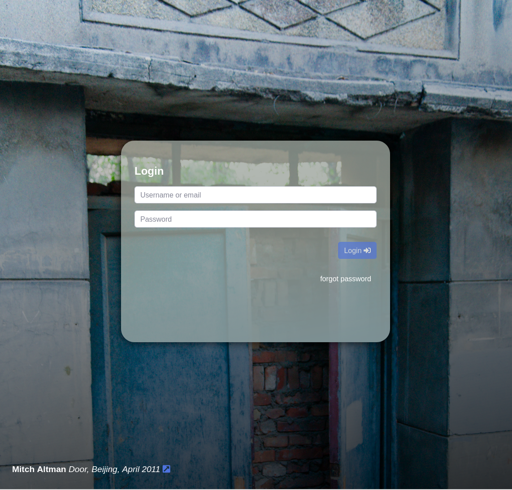
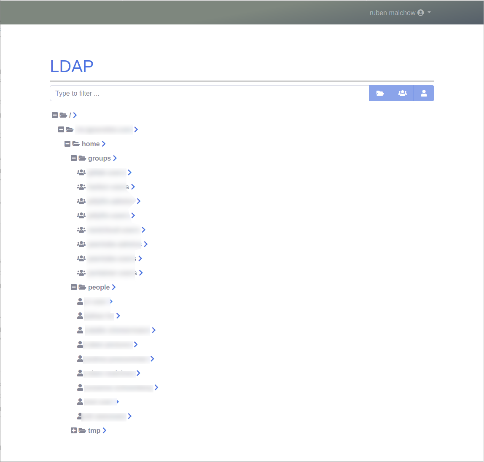
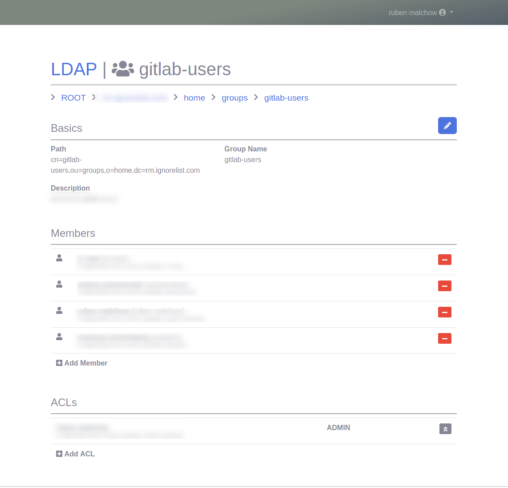

## What this IS

this application is a small and simple UI to manage a basic LDAP setup. it currently works with an embedded Apache DS, and it can do basic user and group management tasks. it also allows you to delegate certain things (e.g. manage users of one group) without dealing with LDAP ACLs.

behind the scenes, all LDAP operations are executed in an administrative session, which has extensive privileges.

this application also ignores a lot of the finer points of LDAP, painting objects with rather coarse strokes. this may or may not be to your liking. For my personal usage, this is actually perfectly fine.

## What this is NOT

this is not a full-on replacement for actual LDAP management tools (e.g. Apache Directory Studio). while basic things are nicer in here, we achieve this by simply ignoring most of the finer points of LDAP: we only do the bare essentials.

## Scenarios

LDAP authentication is supported in a vast number of applications, and even mapping LDAP groups to local permissions is pretty popular. this is what this is for: scenarios where LDAP is not the central organziational platform, but rather a convenient single source of truth for authentication in other applications. if you insist on using LDAP trickery to implement your workflows, this is not for you.

so, this is for you if

- you want to manage media server, nextcloud and home automation access for you and your family at home
- you want to run build tools, a wiki and a git repository for the people in your local maker space.
- in short: if you have a collection of LDAP-capable tools running for a small-ish team, this might help you organize it.

i am planning to (eventually) include a bit more advanced functionality for editing LDAP objects, but this is never going to be THAT big (if you have urges, try FreeIPA or Keycloak or Privacy Idea).

### Some Screenshots

#### Login Screen

#### View LDAP Tree Structure

#### Edit Group Members

## Installation

this is meant to be run as a springboot application inside a docker container. it will need a separate mariaDB instance. the docker image is:   

​		rmalchow/ldap:latest

this needs one volume mounted for the LDAP datafiles. It also needs a MariaDB configured.

#### Docker Compose / Helm

An example docker compose file as well as a helm chart can be found in this repo.

**Env vars for use with docker compose**

| key | value |
| ------- | ------------ |
| URL|"https://users.example.com" |
| NAME | "Example LDAP"|
| MYSQL_HOST | "ldap-mysql"|
| MYSQL_PORT | 3306|
| MYSQL_ROOT_PASSWORD | "mysql_root_pw"|
| MYSQL_DATABASE | "ldap"|
| MYSQL_USER | "ldap"|
| MYSQL_PASSWORD | "mysql_user_pw"|
| LDAP_ROOT_DN | "dc=ldap.example.com"|
| LDAP_ORG | "example-org"|
| LDAP_ADMIN_PW | "admin_pw"|
| MAIL_SENDER | "me@example.com"|
| MAIL_USER | "me-example.com@smtp.server"|
| MAIL_PASSWORD | "smtp_pw"|
| MAIL_HOST | "mail.example.com"|
| MAIL_PORT | 587|

**Values for user with HELM**

| value               | description                                                  |
| ------------------- | ------------------------------------------------------------ |
| ldap.hostname       | hostname of the instance for use in http URLs, e.g. "ldap.example.com" |
| ldap.name           | name of the instance, e.g. "Foobar User Management"          |
| ldap.root           | root of the LDAP tree, e.g. "dc=example,dc=com"              |
| ldap.org            | initial "organization" in the ldap tree, e.g. "foo" (will result in "o=foo,dc=example,dc=com") |
| ldap.admin_password | password of admin user                                       |
| ldap.mail.enabled   | en- or disable mailing                                       |
| ldap.mail.host      | SMTP host                                                    |
| ldap.mail.port      | SMTP port (defaults to 25)                                   |
| ldap.mail.sender    | sender for the SMTP envelope                                 |
| ldap.mail.username  | username for authenticated SMTP (defaults to empty - no authentication) |
| ldap.mail.password  | password for authenticated SMTP (defaults to empty - no authentication) |

## Environment Variables, Directories, Ports

### LDAP container

- container port **8080**
- persistent volume mounted to **/app/data**

| Name            | Value                  | Description                                                  |
| --------------- | ---------------------- | ------------------------------------------------------------ |
| URL             |                        | the public protocol and hostname for this instance, e.g. "https://users.example.com" |
| NAME            |                        | the name of the instance                                     |
| LDAP_ADMIN_PW   |                        | password for the initial admin user                          |
| MYSQL_USERNAME  | "ldap"                 | the user to use on the DB. must have sufficient permissions to execute the flyway migrations (ALTER,DROP,CREATE etc) |
| MYSQL_PASSWORD  | [NONE]                 | the password for the DB user                                 |
| MYSQL_HOST      | "mysql"                | the hostname for the DB                                      |
| MYSQL_PORT      | "3306"                 | ... the port?                                                |
| MYSQL_SCHEMA    | "ldap"                 | the DB schema                                                |
| **SMTP CONFIG** |                        |                                                              |
| MAIL_HOST       |                        | smtp server name                                             |
| MAIL_PORT       |                        | the port to use for outgoing SMTP. this can be STARTTLS. if you are planning to use straight-up TLS, you also have to set: "spring_profiles_active=smtps" |
| MAIL_USER       |                        | username for the SMTP server                                 |
| MAIL_PASSWORD   |                        | password for the SMTP server                                 |
| MAIL_SENDER     |                        | email adress to use for SMTP envelope and reply-to headers   |

### MariaDB container

- container port **3306**
- one volume needed on **/var/lib/mysql**

This is a stock container. See their docs for details.

## APIs

this application also has all functionality available as a REST API. for details on the APIs, see:

​	http://{your instance}/apitester/index.html

### Obtaining Authentication Tokens

authentication is done by sending a POST request to the

​	/api/authenticate

API endpoint with a username, password and (optionally) a list of required groupIds. the return status:

- **200** if everything is OK
- **401** if authentication failed (e.g. incorrect username / password)
- **403** if the user is not authorized (i.e. not a member of the given groups)
- **500** if authentication failed due to an internal error

if everything is ok, the response body will contain a user object, and the server will send a cookie containing a JWT token for this user.

----

**Attention** - JWT authentication tokens issued by the server are very short-lived and must be renewed in regular intervals

----

### Renewing Authentication Tokens

a simple POST call to the authentication endpoint without parameters, but with a valid JWT token will return the authenticated user in the body, along with a freshly issued JWT cookie.
